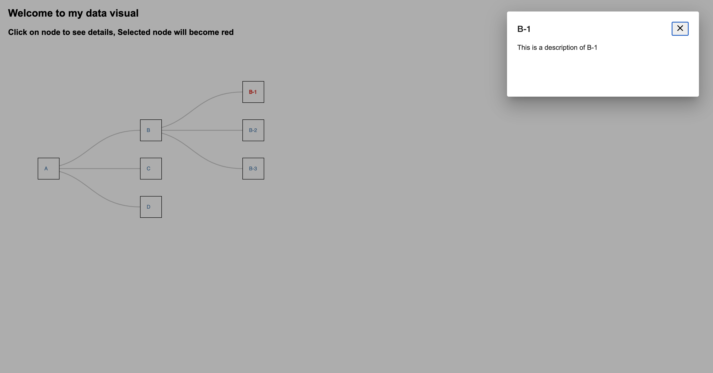

This project was bootstrapped with Angular CLI.

##Online demo##
https://my-data-visual.herokuapp.com/

#Description
As a user, I would like to see the hierarchy of the provided data. If I click one of the nodes, I would like to see the detail of that node.

#API's used:

Express server serving data

#Screenshot: 

#Prerequisites
node and npm

data in flat format eg: {
    data: [
      {
        name: 'A',
        description: 'This is a description of A',
        parent:'',
      },
      {
        name: 'B',
        description: 'This is a description of B',
        parent: 'A',
      },
      {
        name: 'C',
        description: 'This is a description of C',
        parent: 'A',
      },
]
};

#Notes
I am using Angular material for dialog and angular-d3 for creating tree

#Available Scripts
In the project directory, you can run:

npm install - To install all the dependencies

npm run start
Runs the app in the development mode.

npm run test
Launches the test runner in the interactive watch mode.

npm run build
Builds the app for production to the build folder.

# MyDataVisual

This project was generated with [Angular CLI](https://github.com/angular/angular-cli) version 10.2.0.

## Development server
Run npm install in project directory
Run `npm run start` for a dev server. Navigate to `http://localhost:8080/`.

